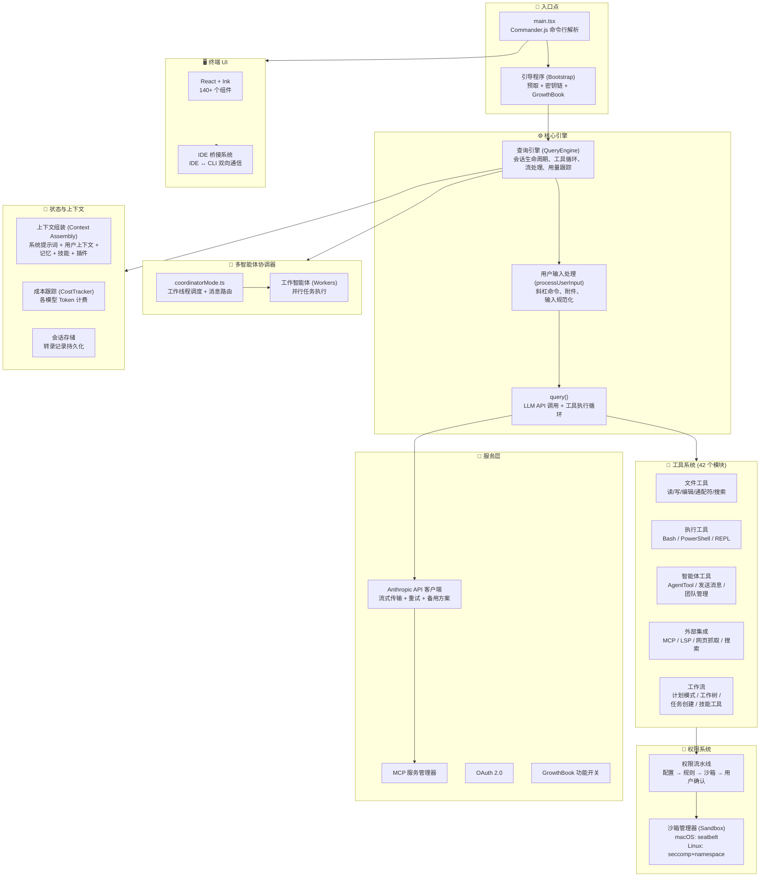
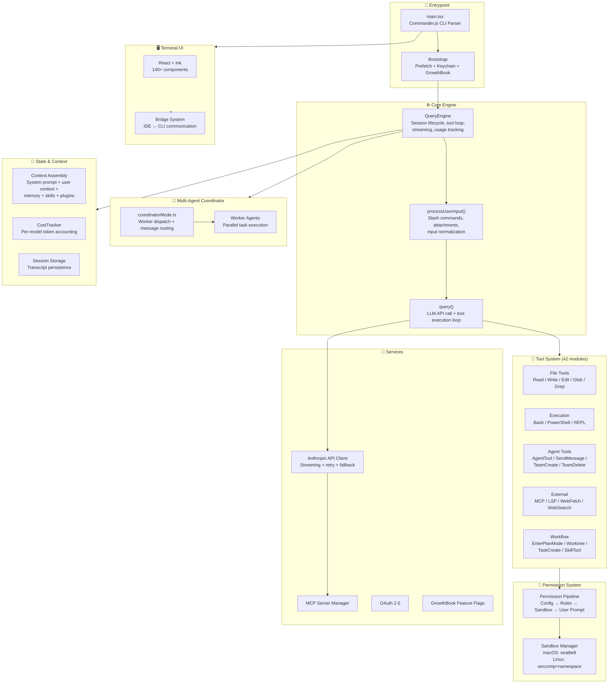

# Claude Code 完整架构 Mermaid 图（存档）

> 此图原来放在 README 首页，因过于复杂被替换为简化版。
> 保留在此供需要时使用，可复制到 [Mermaid Live Editor](https://mermaid.live) 渲染或导出 SVG。

## 中文版

```mermaid
graph TB
    subgraph Entry["🚀 入口点"]
        CLI["main.tsx<br/>Commander.js 命令行解析"]
        BOOT["引导程序 (Bootstrap)<br/>预取 + 密钥链 + GrowthBook"]
    end

    subgraph Core["⚙️ 核心引擎"]
        QE["查询引擎 (QueryEngine)<br/>会话生命周期、工具循环、<br/>流处理、用量跟踪"]
        Q["query()<br/>LLM API 调用 + 工具执行循环"]
        PUI["用户输入处理 (processUserInput)<br/>斜杠命令、附件、<br/>输入规范化"]
    end

    subgraph Tools["🔧 工具系统 (42 个模块)"]
        direction LR
        FS["文件工具<br/>读/写/编辑/通配符/搜索"]
        EXEC["执行工具<br/>Bash / PowerShell / REPL"]
        AGENT["智能体工具<br/>AgentTool / 发送消息 /<br/>团队管理"]
        EXT["外部集成<br/>MCP / LSP / 网页抓取 / 搜索"]
        PLAN["工作流<br/>计划模式 / 工作树 /<br/>任务创建 / 技能工具"]
    end

    subgraph Permission["🔐 权限系统"]
        PP["权限流水线<br/>配置 → 规则 → 沙箱 → 用户确认"]
        SB["沙箱管理器 (Sandbox)<br/>macOS: seatbelt<br/>Linux: seccomp+namespace"]
    end

    subgraph Coord["🤖 多智能体协调器"]
        CM["coordinatorMode.ts<br/>工作线程调度 + 消息路由"]
        WORKERS["工作智能体 (Workers)<br/>并行任务执行"]
    end

    subgraph Services["📡 服务层"]
        API["Anthropic API 客户端<br/>流式传输 + 重试 + 备用方案"]
        MCP["MCP 服务管理器"]
        OAUTH["OAuth 2.0"]
        GB["GrowthBook 功能开关"]
    end

    subgraph UI["🖥️ 终端 UI"]
        INK["React + Ink<br/>140+ 个组件"]
        BRIDGE["IDE 桥接系统<br/>IDE ↔ CLI 双向通信"]
    end

    subgraph State["💾 状态与上下文"]
        CTX["上下文组装 (Context Assembly)<br/>系统提示词 + 用户上下文 +<br/>记忆 + 技能 + 插件"]
        COST["成本跟踪 (CostTracker)<br/>各模型 Token 计费"]
        SESS["会话存储<br/>转录记录持久化"]
    end

    CLI --> BOOT
    BOOT --> QE
    QE --> PUI
    PUI --> Q
    Q --> Tools
    Tools --> PP
    PP --> SB
    QE --> Coord
    CM --> WORKERS
    QE --> State
    Q --> API
    API --> MCP
    CLI --> UI
    UI --> BRIDGE
```

## English Version

```mermaid
graph TB
    subgraph Entry["🚀 Entrypoint"]
        CLI["main.tsx<br/>Commander.js CLI Parser"]
        BOOT["Bootstrap<br/>Prefetch + Keychain + GrowthBook"]
    end

    subgraph Core["⚙️ Core Engine"]
        QE["QueryEngine<br/>Session lifecycle, tool loop,<br/>streaming, usage tracking"]
        Q["query()<br/>LLM API call + tool execution loop"]
        PUI["processUserInput()<br/>Slash commands, attachments,<br/>input normalization"]
    end

    subgraph Tools["🔧 Tool System (42 modules)"]
        direction LR
        FS["File Tools<br/>Read / Write / Edit / Glob / Grep"]
        EXEC["Execution<br/>Bash / PowerShell / REPL"]
        AGENT["Agent Tools<br/>AgentTool / SendMessage /<br/>TeamCreate / TeamDelete"]
        EXT["External<br/>MCP / LSP / WebFetch / WebSearch"]
        PLAN["Workflow<br/>EnterPlanMode / Worktree /<br/>TaskCreate / SkillTool"]
    end

    subgraph Permission["🔐 Permission System"]
        PP["Permission Pipeline<br/>Config → Rules → Sandbox → User Prompt"]
        SB["Sandbox Manager<br/>macOS: seatbelt<br/>Linux: seccomp+namespace"]
    end

    subgraph Coord["🤖 Multi-Agent Coordinator"]
        CM["coordinatorMode.ts<br/>Worker dispatch + message routing"]
        WORKERS["Worker Agents<br/>Parallel task execution"]
    end

    subgraph Services["📡 Services"]
        API["Anthropic API Client<br/>Streaming + retry + fallback"]
        MCP["MCP Server Manager"]
        OAUTH["OAuth 2.0"]
        GB["GrowthBook Feature Flags"]
    end

    subgraph UI["🖥️ Terminal UI"]
        INK["React + Ink<br/>140+ components"]
        BRIDGE["Bridge System<br/>IDE ↔ CLI communication"]
    end

    subgraph State["💾 State & Context"]
        CTX["Context Assembly<br/>System prompt + user context +<br/>memory + skills + plugins"]
        COST["CostTracker<br/>Per-model token accounting"]
        SESS["Session Storage<br/>Transcript persistence"]
    end

    CLI --> BOOT
    BOOT --> QE
    QE --> PUI
    PUI --> Q
    Q --> Tools
    Tools --> PP
    PP --> SB
    QE --> Coord
    CM --> WORKERS
    QE --> State
    Q --> API
    API --> MCP
    CLI --> UI
    UI --> BRIDGE
```
