> 🌐 **Language**: English | [中文版 →](zh-CN/02-tool-system.md)
> 📖 **[Read Online →](https://openedclaude.github.io/claude-reviews-claude/chapters/02-tool-system)** — Sidebar nav, dark mode & full-text search. Better than raw GitHub.


# Tool System Architecture: 42 Modules, One Interface

> **Source files**: `Tool.ts` (793 lines — interface definition), `tools.ts` (390 lines — registry), `tools/` (42+ directories)

## TL;DR

Every action Claude Code takes — reading a file, running bash, searching the web, spawning a sub-agent — goes through a single unified `Tool` interface. 42+ tool modules, each self-contained in its own directory, are assembled at startup through a layered filtering system: feature flags → permission rules → mode restrictions → deny lists.

---

## 1. The Tool Interface: 30+ Methods, One Contract

Every tool in Claude Code implements the same `Tool<Input, Output, Progress>` type. This is a massive interface (793-line file) that covers:

```typescript
export type Tool<Input, Output, P> = {
  // Identity
  readonly name: string
  aliases?: string[]              // Legacy name support
  searchHint?: string             // Keyword for ToolSearch discovery

  // Schema (Zod v4)
  readonly inputSchema: Input     // Runtime validation + TS inference
  outputSchema?: z.ZodType

  // Core execution
  call(args, context, canUseTool, parentMessage, onProgress?): Promise<ToolResult<Output>>

  // Permission pipeline
  validateInput?(input, context): Promise<ValidationResult>
  checkPermissions(input, context): Promise<PermissionResult>
  preparePermissionMatcher?(input): Promise<(pattern: string) => boolean>

  // Behavioral flags
  isEnabled(): boolean
  isReadOnly(input): boolean
  isConcurrencySafe(input): boolean
  isDestructive?(input): boolean
  interruptBehavior?(): 'cancel' | 'block'

  // UI rendering (React + Ink)
  renderToolUseMessage(input, options): React.ReactNode
  renderToolResultMessage?(content, progress, options): React.ReactNode
  renderToolUseProgressMessage?(progress, options): React.ReactNode
  renderGroupedToolUse?(toolUses, options): React.ReactNode | null
  // ... 10+ more render methods
}
```

### The buildTool() Factory

Rather than requiring every tool to implement all 30+ methods, Claude Code uses a factory function with fail-closed defaults:

```typescript
const TOOL_DEFAULTS = {
  isEnabled: () => true,
  isConcurrencySafe: () => false,    // Assume NOT safe
  isReadOnly: () => false,           // Assume writes
  isDestructive: () => false,
  checkPermissions: (input) =>       // Defer to general system
    Promise.resolve({ behavior: 'allow', updatedInput: input }),
  toAutoClassifierInput: () => '',   // Skip classifier
  userFacingName: () => '',
}

export function buildTool<D>(def: D): BuiltTool<D> {
  return { ...TOOL_DEFAULTS, userFacingName: () => def.name, ...def }
}
```

**Design insight**: Defaults are intentionally conservative. A tool that forgets to declare `isConcurrencySafe` defaults to `false` (serialize), not `true` (parallel). A tool that forgets `isReadOnly` defaults to `false` (requires permission). This is _fail-closed_ security by default.

---

## 2. The Tool Registry: Static Array with Dynamic Filtering

All tools are registered in `tools.ts` via `getAllBaseTools()`. This returns a flat array — **not** a plugin registry, not a map, not a DI container. Intentionally simple.

```typescript
export function getAllBaseTools(): Tools {
  return [
    AgentTool,          // Sub-agent spawning
    TaskOutputTool,     // Structured output
    BashTool,           // Shell commands
    GlobTool, GrepTool, // Search (conditional)
    FileReadTool,       // Read files
    FileEditTool,       // Edit files
    FileWriteTool,      // Create files
    NotebookEditTool,   // Jupyter notebooks
    WebFetchTool,       // HTTP requests
    WebSearchTool,      // Web search
    TodoWriteTool,      // Todo management
    // ... 30+ more
  ]
}
```

### Feature-Gated Tools

Many tools only appear when specific build flags are enabled:



The conditional loading pattern uses `bun:bundle` for compile-time elimination:

```typescript
// Compile-time: if PROACTIVE is false, this entire block is dead code
const SleepTool = feature('PROACTIVE') || feature('KAIROS')
  ? require('./tools/SleepTool/SleepTool.js').SleepTool
  : null
```

This means the Bun bundler physically strips the tool from the binary when the flag is off — not just `if`-gating it at runtime.

---

## 3. Tool Categories

The 42+ tools fall into 6 functional categories:

### 📁 File Operations (7 tools)

| Tool | Purpose | Concurrency Safe? |
|------|---------|-------------------|
| `FileReadTool` | Read file contents | ✅ Yes |
| `FileWriteTool` | Create/overwrite files | ❌ No |
| `FileEditTool` | Surgical text edits | ❌ No |
| `GlobTool` | Find files by pattern | ✅ Yes |
| `GrepTool` | Search file content | ✅ Yes |
| `NotebookEditTool` | Edit Jupyter notebooks | ❌ No |
| `SnipTool` | History snipping | ❌ No |

### 🖥️ Execution (3-4 tools)

| Tool | Purpose | Feature Gate |
|------|---------|-------------|
| `BashTool` | Shell commands | Always |
| `PowerShellTool` | Windows PS commands | Runtime check |
| `REPLTool` | VM-based REPL | `USER_TYPE=ant` |
| `SleepTool` | Wait/delay | `PROACTIVE` / `KAIROS` |

### 🤖 Agent Management (6 tools)

| Tool | Purpose | Feature Gate |
|------|---------|-------------|
| `AgentTool` | Spawn sub-agents | Always |
| `SendMessageTool` | Continue a worker | Always |
| `TaskStopTool` | Kill a worker | Always |
| `TeamCreateTool` | Create agent swarm | `AGENT_SWARMS` |
| `TeamDeleteTool` | Delete agent swarm | `AGENT_SWARMS` |
| `ListPeersTool` | List peer agents | `UDS_INBOX` |

### 🌐 External (5+ tools)

| Tool | Purpose | Feature Gate |
|------|---------|-------------|
| `WebFetchTool` | HTTP fetch | Always |
| `WebSearchTool` | Web search | Always |
| `WebBrowserTool` | Browser automation | `WEB_BROWSER_TOOL` |
| `ListMcpResourcesTool` | Browse MCP resources | Conditional |
| `ReadMcpResourceTool` | Read MCP resource | Conditional |
| `LSPTool` | Language Server Protocol | `ENABLE_LSP_TOOL` |

### 📋 Workflow & Planning (8+ tools)

| Tool | Purpose | Feature Gate |
|------|---------|-------------|
| `EnterPlanModeTool` | Enter planning mode | Always |
| `ExitPlanModeV2Tool` | Exit planning mode | Always |
| `EnterWorktreeTool` | Git worktree isolation | Worktree mode |
| `ExitWorktreeTool` | Exit worktree | Worktree mode |
| `SkillTool` | Execute skill files | Always |
| `TaskCreateTool` | Create task | Todo v2 |
| `TaskUpdateTool` | Update task | Todo v2 |
| `TaskListTool` | List tasks | Todo v2 |
| `WorkflowTool` | Run workflow scripts | `WORKFLOW_SCRIPTS` |

### 📡 Notifications & Monitoring (4 tools)

| Tool | Purpose | Feature Gate |
|------|---------|-------------|
| `MonitorTool` | Process monitoring | `MONITOR_TOOL` |
| `SendUserFileTool` | Send file to user | `KAIROS` |
| `PushNotificationTool` | Push notifications | `KAIROS` |
| `SubscribePRTool` | GitHub PR events | `KAIROS_GITHUB_WEBHOOKS` |

---

## 4. The Assembly Pipeline

Tools don't go from registry to LLM directly. They pass through a multi-stage filtering pipeline:

<p align="center">
  
</p>

### Stage 1: Deny Rules

```typescript
export function filterToolsByDenyRules(tools, permissionContext) {
  return tools.filter(tool => !getDenyRuleForTool(permissionContext, tool))
}
```

### Stage 2: Mode Filtering

In **Simple mode** (`CLAUDE_CODE_SIMPLE`), only 3 tools survive:
```typescript
if (isEnvTruthy(process.env.CLAUDE_CODE_SIMPLE)) {
  const simpleTools = [BashTool, FileReadTool, FileEditTool]
  // If also coordinator mode, add AgentTool + TaskStopTool
  return filterToolsByDenyRules(simpleTools, permissionContext)
}
```

In **REPL mode**, primitive tools are hidden (they're wrapped inside the REPL VM):
```typescript
if (isReplModeEnabled()) {
  allowedTools = allowedTools.filter(
    tool => !REPL_ONLY_TOOLS.has(tool.name)
  )
}
```

### Stage 3: MCP Tool Merging

MCP (Model Context Protocol) tools from external servers are merged after built-in tools:

```typescript
export function assembleToolPool(permissionContext, mcpTools): Tools {
  const builtInTools = getTools(permissionContext)
  const allowedMcpTools = filterToolsByDenyRules(mcpTools, permissionContext)

  // Sort: built-in prefix + MCP suffix for prompt cache stability
  return uniqBy(
    [...builtInTools].sort(byName).concat(allowedMcpTools.sort(byName)),
    'name',
  )
}
```

**Key insight**: Built-in tools are sorted as a contiguous prefix, MCP tools as a suffix. This preserves prompt cache stability — adding/removing an MCP tool doesn't invalidate cache for built-in tools.

---

## 5. Tool Search: Lazy Loading for Large Tool Sets

When too many tools are available (MCP can add dozens), a `ToolSearchTool` enables lazy loading:

```typescript
// Tools can declare themselves as deferrable
readonly shouldDefer?: boolean    // Sent with defer_loading: true
readonly alwaysLoad?: boolean     // Never deferred, even with ToolSearch

// ToolSearch uses keyword matching
searchHint?: string  // e.g., 'jupyter' for NotebookEditTool
```

This prevents the LLM's tool schema from becoming overwhelming. Deferred tools aren't in the initial prompt — the model discovers them via `ToolSearchTool` by keyword.

---

## 6. Directory Convention

Each tool follows a consistent directory structure:

```
tools/BashTool/
├── BashTool.ts      # Tool implementation (buildTool({ ... }))
├── prompt.ts        # LLM-facing description text
├── UI.tsx           # React+Ink rendering components
├── constants.ts     # Tool name, limits
└── (optional)
    ├── utils.ts     # Helper functions
    ├── types.ts     # Type definitions
    └── __tests__/   # Tests
```

Larger tools like `AgentTool` have more complex structures:

```
tools/AgentTool/
├── AgentTool.tsx     # 235K — main implementation
├── UI.tsx            # 126K — rendering
├── runAgent.ts       # 37K  — agent execution
├── agentToolUtils.ts # 23K  — utilities
├── prompt.ts         # 17K  — LLM description
├── forkSubagent.ts   # 9K   — fork mechanism
├── resumeAgent.ts    # 10K  — session resume
├── agentMemory.ts    # 6K   — memory management
├── loadAgentsDir.ts  # 27K  — agent definition loading
├── constants.ts
├── builtInAgents.ts
├── agentColorManager.ts
├── agentDisplay.ts
└── built-in/         # Built-in agent definitions
```

---

## Transferable Design Patterns

> The following patterns from the Tool System can be directly applied to any plugin or extension architecture.

### Pattern 1: Behavioral Flags Over Capability Classes

Instead of inheritance hierarchies (`ReadOnlyTool`, `WritableTool`, `ConcurrentTool`), Claude Code uses boolean method flags:

```typescript
isReadOnly(input): boolean      // Can skip permission for read-only ops
isConcurrencySafe(input): boolean  // Can run in parallel
isDestructive?(input): boolean  // Irreversible (delete, overwrite)
```

These flags can be **input-dependent** — e.g., `BashTool.isReadOnly()` returns `true` for `ls` but `false` for `rm`. This is more flexible than class hierarchies.

### Pattern 2: Prompt Cache Stability via Sort Order

Tools are sorted deterministically (built-in prefix + MCP suffix) so that adding an MCP server doesn't invalidate the prompt cache for all tools. This saves significant API cost at scale.

### Pattern 3: Self-Contained Modules

Each tool directory contains everything: implementation, prompt text, UI rendering, tests. No tool reaches into another tool's directory. This makes each tool independently maintainable and testable.

### Pattern 4: Fail-Closed Defaults via buildTool()

The factory pattern ensures security by default — `isConcurrencySafe: false`, `isReadOnly: false`. A developer who forgets to set a flag gets the safer behavior, not the dangerous one.

---

## 8. Tool Pool Assembly: Where Prompt Cache Meets Economics

> Why does tool ordering matter so much? Because a single MCP tool insertion in the wrong position can invalidate the entire prompt cache — costing 12x more input tokens per API call.

// 源码位置: src/tools.ts:345-367

### The Partition-Sort Strategy

`assembleToolPool()` doesn't just merge tools — it enforces a strict partitioned sort order:

```typescript
export function assembleToolPool(permissionContext, mcpTools): Tools {
  const builtInTools = getTools(permissionContext)
  const allowedMcpTools = filterToolsByDenyRules(mcpTools, permissionContext)

  // Partition-sort: built-ins as contiguous prefix, MCP as suffix
  // A flat sort would interleave MCP into built-ins,
  // invalidating all downstream cache keys
  const byName = (a: Tool, b: Tool) => a.name.localeCompare(b.name)
  return uniqBy(
    [...builtInTools].sort(byName).concat(allowedMcpTools.sort(byName)),
    'name',  // Built-in wins on name conflict (uniqBy preserves first)
  )
}
```

The server's `claude_code_system_cache_policy` places a global cache breakpoint after the last built-in tool. If MCP tools interleave into built-ins, every downstream cache key shifts — turning $0.003 cache-hit calls into $0.036 full-price calls.

### Deny Rule Pre-filtering

// 源码位置: src/tools.ts:262-269

Tools are filtered **before being sent to the model** — not just at call time. The model never sees denied tools, avoiding wasted tokens on calls that would be rejected anyway.

---

## 9. Tool Search: Lazy Loading for the LLM Age

> When MCP servers add dozens of tools, the model's prompt becomes overwhelming. ToolSearch provides an elegant solution: defer tools the model doesn't need yet, and let it discover them on demand.

// 源码位置: src/tools.ts:247-249, Tool.ts shouldDefer/alwaysLoad

### How Deferred Tools Work

<p align="center">
  
</p>

| Field | Purpose |
|-------|---------|
| `shouldDefer` | Tool is sent with `defer_loading: true` — model sees the name but not the schema |
| `alwaysLoad` | Never deferred, even when ToolSearch is active |
| `searchHint` | Keywords for ToolSearch matching (e.g., `'jupyter'` for NotebookEditTool) |

### The Schema-Not-Sent Problem

// 源码位置: src/services/tools/toolExecution.ts:578-597

When a model calls a deferred tool without discovering it first, typed parameters (arrays, numbers, booleans) arrive as strings — causing Zod validation failures. The system detects this and injects a helpful hint:

```
"This tool's schema was not sent to the API. Load it first:
 call ToolSearchTool with query 'select:ToolName', then retry."
```

---

## 10. Context Modification: Tools That Change the World

> Some tools don't just produce output — they change the execution context itself. `cd` changes the working directory. How does the system handle this without breaking concurrent execution?

// 源码位置: src/Tool.ts:321-336

### The contextModifier Pattern

```typescript
export type ToolResult<T> = {
  data: T
  newMessages?: Message[]
  contextModifier?: (context: ToolUseContext) => ToolUseContext
  mcpMeta?: { _meta?, structuredContent? }
}
```

A tool can return a `contextModifier` function that transforms the `ToolUseContext` for subsequent operations. For example, a `cd` command modifies the working directory via this mechanism.

### The Concurrency Guard

**Critical constraint**: `contextModifier` only takes effect for tools where `isConcurrencySafe() === false`. The reasoning is simple — if two tools run in parallel and both try to modify the context (e.g., both `cd` to different directories), the final state is nondeterministic. By restricting context modification to serial-only tools, the system eliminates this race condition by design.

---

## 11. The Execution Pipeline: From Model Output to Side Effects

> A tool call is not a simple function invocation. It's a multi-stage pipeline with validation, permission checks, hooks, execution, result processing, and context modification — all orchestrated through an AsyncGenerator.

// 源码位置: src/services/tools/toolExecution.ts:337-490, 599-800+

### runToolUse() Entry Point

```
Model outputs tool_use block
    │
    ▼
runToolUse() — AsyncGenerator<MessageUpdateLazy>
    │
    ├── 1. Find tool (name match → alias fallback → error)
    │
    ├── 2. Check abort signal
    │       → If aborted: yield cancel message, return
    │
    └── 3. streamedCheckPermissionsAndCallTool()
            │
            ├── 4. Zod schema validation (inputSchema.safeParse)
            │       → On failure: check if ToolSearch hint needed
            │
            ├── 5. tool.validateInput() — tool-specific validation
            │
            ├── 6. [BashTool] Speculative classifier start (parallel)
            │
            ├── 7. PreToolUse hooks (can modify input or block)
            │
            ├── 8. canUseTool() — permission decision
            │       ├── allow → proceed
            │       ├── deny → return error
            │       └── ask → interactive prompt / coordinator
            │
            ├── 9. tool.call(input, context, canUseTool, msg, onProgress)
            │
            ├── 10. PostToolUse hooks (can modify output)
            │
            ├── 11. mapToolResultToToolResultBlockParam()
            │
            ├── 12. processToolResultBlock()
            │        → Large results persisted to ~/.claude/tool-results/
            │
            └── 13. Apply contextModifier + inject newMessages
```

### Large Result Persistence

// 源码位置: src/utils/toolResultStorage.ts

When tool output exceeds `maxResultSizeChars`, the system writes it to disk and returns a preview with a file path. The model can then use `FileReadTool` to access the full output:

| Tool | maxResultSizeChars |
|------|--------------------|
| BashTool | 30,000 |
| FileEditTool | 100,000 |
| GlobTool | 100,000 |
| GrepTool | 100,000 |
| FileReadTool | ∞ (has its own limits) |

---

## 12. Search Tools: GlobTool and GrepTool

> These two tools provide the model's "find in project" capability — one for file discovery by pattern, one for content search by regex.

### GlobTool

// 源码位置: src/tools/GlobTool/GlobTool.ts

```typescript
export const GlobTool = buildTool({
  name: GLOB_TOOL_NAME,
  isConcurrencySafe: () => true,   // Pure read — safe for parallel execution
  isReadOnly: () => true,          // No permission needed
  maxResultSizeChars: 100_000,
  async call({ pattern, path }, context) {
    const searchPath = path ? expandPath(path) : getCwd()
    const results = await glob(pattern, searchPath, {
      maxResults: context.globLimits?.maxResults || 100,
    })
    return { data: { filenames: results, numFiles: results.length } }
  }
})
```

Results are sorted by modification time (most recently changed first) and capped at 100 files by default.

### GrepTool

// 源码位置: src/tools/GrepTool/GrepTool.ts

Wraps `ripgrep` (rg) with safety constraints:
- Results capped at 250 matches (`head_limit`) with `offset` for pagination
- Automatic exclusion of `.git`, `.svn`, `node_modules`
- Plugin cache exclusion patterns applied
- Multiple output modes: content, files_with_matches, count
- Context lines support (-A, -B, -C)

Both tools are marked `isConcurrencySafe: true` and `isReadOnly: true` — meaning they can run in parallel without permission prompts.

---

## 13. File Tools: The Model's Hands on Your Codebase

> The file tools form a trinity — Read, Edit, Write — each with distinct safety properties and a shared `FileStateCache` that prevents the model from overwriting your unsaved changes.

### FileReadTool: Six Output Types, One Interface

// 源码位置: src/tools/FileReadTool/FileReadTool.ts:337-718 (1,184 lines total)

FileReadTool is the largest tool in the system. It's not just "read a file" — it's a polymorphic content ingestion engine:

```typescript
type Output =
  | { type: 'text',           file: { content, numLines, startLine, totalLines } }
  | { type: 'image',          file: { base64, type, originalSize, dimensions } }
  | { type: 'notebook',       file: { filePath, cells } }
  | { type: 'pdf',            file: { filePath, base64, originalSize } }
  | { type: 'parts',          file: { filePath, count, outputDir } }  // large PDF → page images
  | { type: 'file_unchanged', file: { filePath } }                    // dedup optimization
```

**Dedup optimization**: If the model reads the same file/range twice and the file hasn't changed (mtime match), it returns a `file_unchanged` stub instead of the full content. Internal telemetry shows ~18% of Read calls are same-file collisions — this saves significant `cache_creation` tokens.

**Security constraints**:
- Blocked device paths (`/dev/zero`, `/dev/random`, `/dev/stdin`) — would hang the process
- UNC path check — prevents Windows NTLM credential leakage via SMB
- `maxResultSizeChars: Infinity` — because persisting to disk for the model to re-read creates a circular dependency

### FileEditTool: String Replacement with Stale Write Detection

// 源码位置: src/tools/FileEditTool/FileEditTool.ts:86-595 (626 lines total)

FileEditTool uses **string replacement**, not diff/patch. The model provides `old_string` and `new_string`:

```typescript
type Input = {
  file_path: string
  old_string: string    // must exist in file and be unique (or use replace_all)
  new_string: string
  replace_all?: boolean
}
```

**The Stale Write Guard** (the most critical safety mechanism):

```
1. Model reads file → FileStateCache records { content, mtime }
2. User edits file externally → mtime changes
3. Model attempts edit → mtime > cached mtime → REJECT
   "File has been modified since read. Read it again."
```

This prevents the model from overwriting your manual edits. On Windows, a content-comparison fallback handles false positives from cloud sync and antivirus timestamp bumps.

**Validation pipeline** (8 checks before any write):
1. Team memory secret detection (prevents API keys in shared memory)
2. `old_string !== new_string` (no-op guard)
3. Deny rule check (permission settings)
4. File size limit (1 GiB — V8 string length boundary)
5. Stale write detection (mtime + content comparison)
6. `old_string` existence check
7. Uniqueness check (non-`replace_all` mode)
8. Settings file special validation

### FileWriteTool: Create or Overwrite

FileWriteTool is deliberately simple — it creates new files or completely overwrites existing ones. It shares the same permission pipeline as FileEditTool. Auto-creates parent directories. Use it when `old_string` would be the entire file content.

### The FileStateCache: Shared State Across All Three

All three tools share a `readFileState` Map keyed by absolute path. FileReadTool writes entries on read; FileEditTool checks entries before write and updates after write. This shared cache is what makes stale write detection possible across the Read→Edit workflow.

---

## Summary

| Aspect | Detail |
|--------|--------|
| **Interface** | Single `Tool` type, 30+ methods (793-line file) |
| **Registry** | Flat array in `getAllBaseTools()`, not a plugin system |
| **Total tools** | 42+ built-in + unlimited MCP tools |
| **Gating** | 3 layers: build flags (`bun:bundle`), env vars, runtime checks |
| **Assembly** | Partition-sort (built-in prefix + MCP suffix) for prompt cache stability |
| **Schema** | Zod v4 for runtime validation + type inference |
| **Convention** | One directory per tool, self-contained (impl + prompt + UI) |
| **Defaults** | Fail-closed via `buildTool()` factory |
| **ToolSearch** | Deferred tools → discover on demand → schema-not-sent detection |
| **Execution** | 13-step pipeline: find → validate → hooks → permissions → call → hooks → persist |
| **Context** | `contextModifier` — only for non-concurrent tools (race condition prevention) |
| **Result Size** | Per-tool `maxResultSizeChars`; overflow → disk persistence + preview |
| **File Tools** | Read (6 output types + dedup) / Edit (8-check validation + stale write guard) / Write (simple overwrite) |

---

**Previous**: [← 01 — Query Engine](./01-query-engine)
**Next**: [→ 03 — Multi-Agent Coordinator](./03-coordinator)
