# 00 — The Complete Architecture of Claude Code

> 🌐 **Language**: English | [中文版 →](/zh-CN/overview)
> 📖 **[Read Online →](https://openedclaude.github.io/claude-reviews-claude/overview)** — Sidebar nav, dark mode & full-text search. Better than raw GitHub.


> **What this document is.** This is the capstone chapter of the *Claude Code Deep Dive* series — a micro-encyclopedia that distills 17 architectural episodes into a single, self-contained reference. Read it as a map before diving into individual chapters, or as a refresher after you've explored them all.
>
> **What this document is not.** It is not a replacement for the deep-dive episodes. Each section below is an *elevator pitch* — the 60-second version of a subsystem that may span 500–900 lines in its dedicated chapter.

---

---

# Part I — Navigation

## §1 Global Architecture Map

Claude Code's power comes not from a single killer feature, but from **six pillars working in concert** — each one amplifying the others:

```
                        ┌─────────────────────────┐
                        │     System Prompt        │
                        │  (Identity + Rules +     │
                        │   42+ Tool Descriptions) │
                        └────────────┬────────────┘
                                     │
                  ┌──────────────────┼──────────────────┐
                  │                  │                  │
         ┌───────▼────────┐ ┌──────▼───────┐ ┌───────▼────────┐
         │  Tool System   │ │  Query Loop  │ │    Context     │
         │  (42+ tools,   │ │  (12-step    │ │  Management    │
         │   30+ methods  │ │   state      │ │  (4-layer      │
         │   per tool)    │ │   machine)   │ │   compression) │
         └───────┬────────┘ └──────┬───────┘ └───────┬────────┘
                  │                  │                  │
                  └──────────────────┼──────────────────┘
                                     │
                  ┌──────────────────┼──────────────────┐
                  │                  │                  │
         ┌───────▼────────┐ ┌──────▼───────┐ ┌───────▼────────┐
         │  Permission &  │ │  Multi-Agent │ │  Skill &       │
         │  Security      │ │  Swarm       │ │  Plugin        │
         │  (7-layer      │ │  (3 backends,│ │  (6 sources,   │
         │   defense)     │ │   7 tasks)   │ │   MCP proto)   │
         └────────────────┘ └──────────────┘ └────────────────┘
```

**The data flow in one sentence:**

```
User Input → CLI (cli.tsx) → QueryEngine.query() → System Prompt Assembly
  → Stream API Call → Tool Extraction → Permission Check → Tool Execution
  → Result Injection → Continue/End Decision → Next Iteration or Response
```

**The six design philosophies that bind these pillars together:**

| # | Philosophy | One-liner |
|---|-----------|-----------|
| 1 | **LLM = Brain, Harness = Body** | The LLM reasons; the harness perceives, acts, remembers, and constrains |
| 2 | **Tools = Capability Boundary** | Claude can only do what its registered tools allow |
| 3 | **Context is the Scarcest Resource** | 200K tokens sounds generous until a medium project fills it |
| 4 | **Zero-Trust Security** | Every tool call passes through multi-layer permission checks |
| 5 | **Loop Until Done** | Not request-response — `call → tools → results → repeat` |
| 6 | **Extensibility Determines the Ceiling** | Skills, Plugins, MCP let capability grow without core changes |

---

## §2 Episode Index: One Line Per Chapter

| EP | Title | Elevator Pitch | Lines |
|----|-------|---------------|-------|
| 01 | [QueryEngine: The Brain](./chapters/01-query-engine) | The `while(true)` loop that turns an LLM into an agent — 12-step pipeline, AsyncGenerator streaming, error recovery | 711 |
| 02 | [Tool System: 42 Modules, One Interface](./chapters/02-tool-system) | 30+ method contract per tool, Schema-driven registration, three-layer filtering, streaming parallel execution | 665 |
| 03 | [Multi-Agent Coordinator](./chapters/03-coordinator) | tmux/iTerm2/in-process backends, AsyncLocalStorage isolation, automatic environment detection | 342 |
| 04 | [Plugin System: Full Lifecycle](./chapters/04-plugin-system) | Plugin = Skills + Hooks + MCP Servers; 6 skill sources, background install reconciliation | 548 |
| 05 | [Hook System: 20 Event Types](./chapters/05-hook-system) | PreToolUse / PostToolUse / Notification hooks, MCP transport, veto & mutation semantics | 299 |
| 06 | [Bash Engine: Sandboxes & Pipelines](./chapters/06-bash-engine) | 6-layer defense-in-depth, tree-sitter AST parsing, macOS Seatbelt sandbox | 458 |
| 07 | [Permission Pipeline: Rules to Kernel](./chapters/07-permission-pipeline) | 7 rule sources, Bash AST security, speculative YOLO classifier, OAuth 2.0 PKCE | 619 |
| 08 | [Agent Swarms: Team Coordination](./chapters/08-agent-swarms) | 7 TaskState variants, SendMessage protocol, DreamTask memory consolidation, UltraPlan | 503 |
| 09 | [Session Persistence](./chapters/09-session-persistence) | JSONL append-only storage, resume/fork/search, cross-session memory | 411 |
| 10 | [Context Assembly](./chapters/10-context-assembly) | System prompt layering, token budget allocation, dynamic attachments, slash commands | 473 |
| 11 | [Compact System](./chapters/11-compact-system) | 4-layer compression (micro → snip → auto → reactive), circuit breakers, prompt-cache sharing | 372 |
| 12 | [Startup & Bootstrap](./chapters/12-startup-bootstrap) | Import-gap parallelism, fast-path dispatch, memoized init, `state.ts` leaf-module pattern | 393 |
| 13 | [Bridge System](./chapters/13-bridge-system) | CLI ↔ IDE WebSocket bridge, 3 spawn modes, Chrome extension integration | 346 |
| 14 | [UI & State Management](./chapters/14-ui-state-management) | Forked Ink + React 19, W3C event model in terminal, 35-line store, Vim mode FSM | 980 |
| 15 | [Services & API Layer](./chapters/15-services-api-layer) | queryModel() 700-line core, multi-provider factory, SSE stream pipeline, retry engine | 691 |
| 16 | [Infrastructure & Config](./chapters/16-infrastructure-config) | Bootstrap singleton, 5-layer settings merge, secure storage, CLAUDE.md memory system | 876 |

> **Total**: ~8,687 lines of architectural analysis across 16 deep-dive episodes + this overview.

---

## §3 Reading Order: Six Cognitive Paths

Not everyone should read these episodes in numerical order. Here are six paths optimized for different goals:



| Path | Name | Best For | Episodes |
|------|------|----------|----------|
| 🟢 A | **Core Loop** | First-time readers | 00 → 12 → 01 → 02 |
| 🔵 B | **Security & Resources** | Security engineers, cost optimizers | → 06 → 07 → 10 → 11 |
| 🟣 C | **Collaboration & Extension** | Plugin developers, multi-agent builders | → 03 → 08 → 04 → 05 |
| 🟠 D | **Infrastructure** | Backend engineers, platform teams | → 15 → 16 → 09 |
| 🔴 E | **Experience Layer** | UI developers, IDE integrators | → 13 → 14 |
| 🟡 F | **The Dark Side** | Privacy researchers, ops engineers | → 17 |

> **Minimum viable reading**: Path A alone (4 episodes, ~2,100 lines) gives you 60% of the architectural understanding. Add Path B for 85%. Path F is a standalone capstone — readable after any path to understand the production telemetry, model codename concealment, and remote operational control systems.

---

# Part II — Core Architecture at a Glance

> Each section below is an *elevator pitch* — the essential insight of a subsystem in under 80 lines. Follow the "→ Deep dive" link at the end for the full episode.

## §4 Harness: The Body Around the Brain

The LLM is the brain. The *harness* is everything else — the runtime infrastructure that gives the brain perception, action, memory, and safety:

| Capability | Implementation | Brain's View |
|-----------|---------------|--------------|
| **Perceive files** | FileReadTool, GlobTool, GrepTool | "I can see the codebase" |
| **Modify code** | FileEditTool, FileWriteTool | "I can change things" |
| **Execute commands** | BashTool (sandboxed) | "I can run and test" |
| **Search the web** | WebSearchTool, WebFetchTool | "I can look things up" |
| **Interact with user** | AskUserQuestionTool, permission dialogs | "I can ask questions" |
| **Dispatch work** | AgentTool, TeamCreate, SendMessage | "I can delegate" |
| **Remember** | CLAUDE.md, memdir, auto-memory | "I have long-term memory" |
| **Extend ability** | MCPTool, SkillTool, Plugin system | "I can learn new tricks" |

**The System Prompt** is the harness's most critical artifact — not a simple "you are an AI", but a layered construction:

```
System Prompt Construction (by token priority):
  1. Core identity & rules            ← Who I am, what I can/cannot do
  2. Tool descriptions (42+ tools)    ← ~10K+ tokens of capability definitions
  3. Git status & project context     ← Current branch, recent commits
  4. CLAUDE.md content                ← Project-specific instructions
  5. User/enterprise rules            ← Preferences, org policies
  6. Dynamic attachments              ← Skill discovery, memory injection, MCP resources
```

**Startup optimization** is a millisecond-level battle. The `main.tsx` entry point exploits ES module evaluation order to run I/O operations *during* import resolution — a technique called **import-gap parallelism**:

```typescript
// Source: src/main.tsx (conceptual)
import { profileCheckpoint } from './utils/startupProfiler.js'
profileCheckpoint('main_tsx_entry')

import { startMdmRawRead } from './utils/settings/mdm/rawRead.js'
startMdmRawRead()                    // ← MDM subprocess starts NOW

import { startKeychainPrefetch } from './utils/secureStorage/keychainPrefetch.js'
startKeychainPrefetch()              // ← Keychain read starts NOW

// Next ~135ms of import evaluation = FREE parallel window
import { Command } from '@commander-js/extra-typings'
// ... more imports while I/O completes in background
```

> → Deep dive: [Episode 12: Startup & Bootstrap](./chapters/12-startup-bootstrap) | [Episode 16: Infrastructure](./chapters/16-infrastructure-config)

---

## §5 The Core Loop: A 12-Step State Machine

Claude Code is not "send a prompt, get a response." It is a **while(true) loop** — the core amplifier that turns a single-shot LLM into an iterative agent:

```
User: "Fix the bug in login.tsx"
  │
  ▼
QueryEngine.submitMessage()
  │
  ▼
query() while(true) {
  ├─→ Context compression checks (steps 1-6)
  ├─→ callModel() — streaming API call (step 7)
  ├─→ StreamingToolExecutor — parallel tool execution (step 8, concurrent with 7!)
  ├─→ Permission check → execute tool → collect result
  ├─→ Inject tool results into message history
  ├─→ Check termination (end_turn? budget exceeded?)
  └─→ continue with enriched context
}
```

**The 12 steps in detail:**

| Step | Name | Purpose |
|------|------|---------|
| 1 | `applyToolResultBudget` | Trim oversized tool results |
| 2 | `snipCompact` | Truncate oldest conversation turns |
| 3 | `microcompact` | Clear stale tool outputs (time-decay) |
| 4 | `contextCollapse` | Fold redundant context |
| 5 | `autocompact` | AI-generated conversation summary |
| 6 | `tokenWarningState` | Budget check & user warning |
| 7 | `callModel` | Streaming API call |
| 8 | `StreamingToolExecutor` | Execute tools *as they stream in* |
| 9 | `stopHooks` | Evaluate stop conditions |
| 10 | `tokenBudget check` | Hard budget enforcement |
| 11 | `getAttachmentMessages` | Inject memory, skill discovery |
| 12 | `state transition` | Update state, continue loop |

**Why AsyncGenerator?** The entire loop uses `async *query()` — providing natural backpressure (the UI controls the pace), lazy evaluation, composability (generators wrap generators), and cancellation (`return()` kills the chain).

**Error recovery is not optional:**

```
429 (rate limit)      → exponential backoff, 3 retries
529 (overloaded)      → fallback to Sonnet model
prompt-too-long       → reactive compact (emergency compression)
max_output_tokens hit → auto-escalate: 8K → 16K → 32K → 64K
stream disconnect     → disable keep-alive, 90s watchdog abort
```

> → Deep dive: [Episode 01: QueryEngine](./chapters/01-query-engine)

---

## §6 Tool System: Capabilities as Contracts

Every tool implements a **30+ method contract** — not just `execute(input)`, but a comprehensive interface covering identity, execution, security, concurrency, and UI rendering:

```typescript
// Source: src/Tool.ts (simplified)
type Tool = {
  // Identity
  name: string
  inputSchema: ZodSchema          // Zod → JSON Schema → API tool definition
  description(input): string      // Dynamic (can vary by input)

  // Execution
  call(args, context): ToolResult

  // Security (every tool must declare its nature)
  checkPermissions(input): PermissionResult
  validateInput(input): ValidationResult
  isReadOnly(input): boolean       // default: false (fail-closed)
  isDestructive(input): boolean

  // Concurrency
  isConcurrencySafe(input): boolean  // default: false (conservative)

  // UI rendering
  renderToolUseMessage(input): ReactNode
  renderToolResultMessage(result): ReactNode

  // Deferred loading
  shouldDefer?: boolean            // Loaded on-demand via ToolSearchTool
  searchHint?: string
}
```

**Three-layer tool filtering** ensures the model only sees tools appropriate for the current context:

```
getAllBaseTools()
  ├── Feature gate: feature('AGENT_TRIGGERS') ? cronTools : []
  ├── Environment gate: process.env.USER_TYPE === 'ant' ? [ConfigTool] : []
  └── Capability gate: isTodoV2Enabled() ? [TaskTools] : []
       │
       ▼
filterToolsByDenyRules()         ← Enterprise policy can block specific tools
       │
       ▼
isEnabled() per-tool filter      ← Tool's own enable condition
       │
       ▼
assembleToolPool()               ← Merge MCP tools, deduplicate (built-in wins)
       │                         ← STABLE SORT for prompt cache key stability
       ▼
Model-visible tool list
```

**The BashTool** is the most complex tool (~156K of code) because it wields the most dangerous capability — arbitrary shell execution. It employs 6 layers of defense-in-depth, from safe-wrapper stripping through tree-sitter AST parsing to macOS Seatbelt OS-level sandboxing.

> → Deep dive: [Episode 02: Tool System](./chapters/02-tool-system) | [Episode 06: Bash Engine](./chapters/06-bash-engine)

---

## §7 Context Management: The Scarcest Resource

A typical Claude Code session consumes context like this:

```
200K token context window
  - System Prompt:           ~5-15K tokens (tool descriptions dominate)
  - CLAUDE.md + project ctx: ~2-5K tokens
  - Conversation history:    ~50-150K tokens (grows with each turn)
  - Tool results:            ~20-100K tokens (one large file = 10K+)
  - Reserved for output:     ~8-64K tokens
  ─────────────────────────
  = Almost always running near capacity
```

**Four-layer compression keeps the system alive:**

```
┌────────────────────────────────────────────────────────────┐
│ Layer 0: API-side context_management                       │
│   Server auto-clears old tool results and thinking blocks  │
│   Zero client overhead — fires first                       │
├────────────────────────────────────────────────────────────┤
│ Layer 1: microcompact                                      │
│   Time-decay: old tool results → "[content cleared]"       │
│   Preserves most recent 40K token window                   │
├────────────────────────────────────────────────────────────┤
│ Layer 2: snipCompact                                       │
│   Truncate oldest conversation turns entirely              │
│   Fastest, but loses the most context                      │
├────────────────────────────────────────────────────────────┤
│ Layer 3: autocompact                                       │
│   Fork a sub-agent to generate conversation summary        │
│   Shares prompt cache with main session (cost efficient)   │
│   Circuit breaker: 3 consecutive failures → stop trying    │
├────────────────────────────────────────────────────────────┤
│ Layer 4: reactiveCompact                                   │
│   Triggered ONLY when API returns prompt-too-long          │
│   Last resort — emergency compression                      │
└────────────────────────────────────────────────────────────┘
```

**Token estimation uses three precision levels** — rough (`bytes/4`, zero-cost), proxy (Haiku model `usage.input_tokens`, cheap), and exact (`countTokens` API, precise but slow). The system escalates only when needed.

**Prompt cache is the invisible performance multiplier.** In a 100-turn conversation, the system prompt is sent 100 times. Three-tier caching (ephemeral 5min / 1h TTL / global scope) with **beta-header latching** (once activated, never deactivated mid-session) keeps cache-key stability and avoids the 12× cost penalty of a cache miss.

> → Deep dive: [Episode 10: Context Assembly](./chapters/10-context-assembly) | [Episode 11: Compact System](./chapters/11-compact-system)

---

## §8 Permission & Security: The Foundation, Not the Ceiling

Security in Claude Code is **defense-in-depth** — every layer assumes the previous one was bypassed:

```
User/LLM produces a tool call
  │
  ▼
┌─ Layer 1: Tool-level validation ──────────────────────┐
│  Zod schema validation + validateInput()              │
│  isReadOnly() / isDestructive() declarations          │
├─ Layer 2: Permission rule matching ───────────────────┤
│  7 sources merged by priority:                        │
│    policySettings (enterprise, unoverridable)         │
│    → localSettings → userSettings → projectSettings   │
│    → session → cliArg → command                       │
│  Result: allow / deny / ask                           │
├─ Layer 3: Bash-specific security ─────────────────────┤
│  stripSafeWrappers() — unwrap timeout/nohup/nice      │
│  23 injection checks ($(), ${}, Unicode whitespace)   │
│  tree-sitter AST parsing (fail-closed on parse error) │
│  Read-only command whitelist (flag-level granularity)  │
│  Path boundary validation                             │
├─ Layer 4: Speculative YOLO classifier ────────────────┤
│  AI side-query: "is this command safe?"               │
│  Starts speculatively, 2s timeout → default path      │
│  3 consecutive rejections → downgrade to interactive   │
├─ Layer 5: User confirmation dialog ───────────────────┤
│  Interactive permission prompt (when mode = ask)       │
├─ Layer 6: OS-level sandbox ───────────────────────────┤
│  macOS Seatbelt: filesystem & network isolation        │
│  Final firewall — even if all above layers fail        │
└───────────────────────────────────────────────────────┘
```

**The design principle:** Security-related checks **fail-closed** (unknown → deny). Availability-related checks **fail-open** (policy server down → allow all, use local cache).

> → Deep dive: [Episode 07: Permission Pipeline](./chapters/07-permission-pipeline) | [Episode 06: Bash Engine](./chapters/06-bash-engine)

---

## §9 Multi-Agent: From Soloist to Orchestra

When a task exceeds a single context window, Claude Code doesn't compress harder — it **divides and conquers** with sub-agents:

```typescript
// Source: src/tools/AgentTool (conceptual)
AgentTool.call({
  name: "researcher",
  prompt: "Investigate the root cause of this bug",
  subagent_type: "Explore",     // read-only agent
  model: "opus",
  run_in_background: true,      // non-blocking
})
```

**Three execution backends, auto-detected:**

| Backend | Detection | Isolation | Visual |
|---------|-----------|-----------|--------|
| iTerm2 | `it2` CLI available | Separate tabs | Each agent = 1 tab |
| tmux | `tmux` binary available | Separate panes | Split-screen view |
| In-process | Fallback | AsyncLocalStorage | Shared terminal |

**Seven task types** model every kind of background work:

```
LocalShell        — Shell process for command execution
LocalAgent        — Full agent with own context window
RemoteAgent       — Agent on remote infrastructure
InProcessTeammate — In-process co-worker (AsyncLocalStorage isolated)
LocalWorkflow     — Deterministic workflow execution
MonitorMcp        — MCP server health monitoring
DreamTask         — Automatic memory consolidation (background)
```

**Team coordination** uses TaskList as shared state, SendMessage for async communication, and structured message types (`shutdown_request`, `plan_approval_response`) for protocol-level coordination. UltraPlan mode enables hierarchical planning with `ultraplanPhase: 'needs_input' | 'plan_ready'`.

> → Deep dive: [Episode 03: Coordinator](./chapters/03-coordinator) | [Episode 08: Agent Swarms](./chapters/08-agent-swarms) | [Episode 13: Bridge](./chapters/13-bridge-system)

---

## §10 Skill & Plugin: Self-Evolving Architecture

**Skills are reusable prompt workflows** — defined in YAML frontmatter + markdown, they are "prompt as code":

```yaml
---
name: commit
description: Create a git commit with AI-generated message
type: prompt
allowedTools: [Bash, Read, Glob, Grep]
context: inline    # inline = run in current context
                   # fork = run in sub-agent
---
Analyze all staged changes and generate a conventional commit message...
```

**Six skill sources, hierarchically merged:**

```
1. bundled/           ← Built-in skills (batch, loop, claudeApi, updateConfig)
2. ~/.claude/skills/  ← User-defined skills
3. plugin skills      ← Plugin-provided
4. managed skills     ← Enterprise-managed
5. MCP skills         ← MCP server-provided
6. command skills     ← Legacy command conversions (deprecated)
```

**Plugins are the composition unit** — a plugin bundles skills + hooks + MCP servers:

```typescript
Plugin = {
  name: "my-plugin@builtin",
  skills: SkillDefinition[],        // Prompt workflows
  hooks: HookDefinition[],          // Lifecycle interceptors
  mcpServers: McpServerConfig[],    // External tool servers
  defaultEnabled: boolean,          // User can toggle
}
```

**MCP (Model Context Protocol)** is the universal extension pipe — 6 transport types (stdio / sse / http / ws / sdk / sse-ide), tool discovery via `ListTools`, and OAuth/XAA authentication. Any MCP server's tools appear alongside built-in tools with zero distinction from the model's perspective.

**Hook system** provides 20 event types for full lifecycle interception — from `PreToolUse` (veto or mutate a tool call before execution) to `Notification` (observe without blocking). Hooks can be configured per-tool, per-event, with both MCP and local execution modes.

> → Deep dive: [Episode 04: Plugin System](./chapters/04-plugin-system) | [Episode 05: Hook System](./chapters/05-hook-system)

---

# Part III — Engineering Excellence

## §11 Seven Engineering Practices Worth Studying

Beyond architecture, Claude Code demonstrates engineering craftsmanship that deserves independent study. Each practice below includes the **why**, the **how**, and a code example.

### 11.1 Dead Code Elimination via Compile-Time Feature Flags

```typescript
// Source: various modules (conceptual)
import { feature } from 'bun:bundle'

// At compile time, feature('VOICE_MODE') becomes true or false.
// The false branch is COMPLETELY REMOVED by Bun's bundler — no runtime cost.
const voiceCommand = feature('VOICE_MODE')
  ? require('./commands/voice/index.js').default
  : null
```

**Three conditional-loading tiers** coexist: compile-time DCE (`feature()`), runtime environment checks (`process.env.USER_TYPE`), and runtime capability detection (`isTodoV2Enabled()`). The harshest elimination happens first, so the final bundle only contains code the user can actually reach.

### 11.2 Circular Dependency Elimination: The Leaf Module Pattern

The biggest circular dependency risk in Claude Code is `bootstrap/state.ts` — a ~55KB global state singleton imported by virtually every module. The solution is architectural:

```
        ┌──── Any src/ module ────┐
        │                         │
        ▼                         ▼
  bootstrap/state.ts        bootstrap/state.ts
  (LEAF node: imports       (LEAF node: imports
   NOTHING from src/)        NOTHING from src/)
```

**This is not a suggestion — it's enforced.** A custom ESLint rule (`custom-rules/bootstrap-isolation`) statically verifies that `state.ts` never imports from `src/`. Only external packages and type-only imports are allowed.

For dynamic dependencies (e.g., `tools.ts → TeamCreateTool → ... → tools.ts`), lazy `require()` calls break the cycle at the consumer site.

### 11.3 The 35-Line Store That Replaced Redux

Instead of pulling in Redux, Zustand, or MobX, Claude Code uses a **35-line `createStore`** function:

```typescript
// Source: src/state/store.ts (simplified)
function createStore<T>(initialState: T, onChange?) {
  let state = initialState
  const listeners = new Set<() => void>()
  return {
    getState: () => state,
    setState: (updater: (prev: T) => T) => {
      const prev = state
      const next = updater(prev)
      if (Object.is(next, prev)) return  // Reference equality skip
      state = next
      onChange?.({ newState: next, oldState: prev })
      for (const listener of listeners) listener()
    },
    subscribe: (listener: () => void) => {
      listeners.add(listener)
      return () => listeners.delete(listener)
    }
  }
}
```

**Why this works:** React 19's `useSyncExternalStore` hook handles the subscription glue. The store only needs to be a state container with `getState`/`subscribe` — exactly what these 35 lines provide. The `Object.is` check prevents unnecessary re-renders, and the `onChange` callback centralizes side-effect handling in `onChangeAppState()`.

### 11.4 Forked Ink: Building a Browser in the Terminal

Claude Code doesn't use Ink as-is — it **forks and deeply transforms** the terminal UI framework:

| Aspect | Stock Ink | Claude Code Fork |
|--------|-----------|-----------------|
| React mode | `LegacyRoot` | `ConcurrentRoot` (React 19) |
| Event system | None | W3C capture/bubble model |
| Screen mode | Inline | Full alt-screen + mouse tracking |
| Buffering | Single buffer | Double-buffer + ANSI diff |
| Selection | None | Mouse drag-select + clipboard |
| Scrolling | None | VirtualMessageList + height cache |
| Layout | Basic Yoga | Extended Yoga + `<Spacer>` |

The rendering pipeline is a full graphics pipeline crammed into a terminal:

```
stdin → keypress parse → DOM event dispatch → React update
  → Yoga layout → Screen buffer → ANSI diff → stdout
  (16ms throttle, double-buffer swap)
```

### 11.5 Vim Mode: A Textbook Finite State Machine

The input editor implements Vim keybindings as a **clean FSM** with four states:

```
                 ┌───────────────────┐
   ESC / Ctrl-[  │                   │  i / a / o / A / I / O
        ┌───────→│   NORMAL MODE     │←───────┐
        │        │                   │         │
        │        └───┬───────────┬───┘         │
        │            │           │              │
        │       d/c/y│      f/t/F│              │
        │            ▼           ▼              │
        │    ┌───────────┐ ┌──────────┐        │
        │    │ OPERATOR   │ │ FIND     │        │
        │    │ PENDING    │ │ PENDING  │        │
        │    └───────────┘ └──────────┘        │
        │                                       │
        │        ┌───────────────────┐         │
        └────────│   INSERT MODE     │─────────┘
                 └───────────────────┘
```

Each state has explicit entry/exit actions and a bounded set of transitions — making the behavior predictable, testable, and extensible.

### 11.6 Import-Gap Parallelism: Free Concurrency

The startup sequence exploits a subtle property of ES module evaluation: the gap between `import` statements is *synchronous dead time* where previously launched async operations run for free:

```
Timeline:
  0ms   startMdmRawRead()        ← Launch MDM subprocess
  1ms   startKeychainPrefetch()  ← Launch keychain read
  2ms   [importing commander]    ← 40ms of synchronous import evaluation
 42ms   [importing chalk]        ← 30ms more
 72ms   [importing React]        ← 60ms more
135ms   [all imports done]       ← MDM and keychain have been running for 135ms!
```

No `Promise.all`, no explicit parallelism — just strategic placement of async launches between import statements.

### 11.7 Fail-Open vs Fail-Closed: The Engineering Judgment Call

Claude Code makes a **deliberate, documented choice** for every failure mode:

```
FAIL-CLOSED (security priority):
  ✗ Bash command parse error    → refuse execution (PARSE_ABORTED)
  ✗ Permission check timeout    → default deny
  ✗ Unknown command category    → require user confirmation

FAIL-OPEN (availability priority):
  ✓ policyLimits load failure   → allow all operations
  ✓ remoteManagedSettings timeout → use local cache (stale-while-error)
  ✓ GrowthBook unavailable      → use default feature flags
  ✓ MCP server disconnected     → continue with remaining tools
```

**The boundary is clear:** anything touching user data or system access fails closed. Anything touching configuration or external services fails open. This distinction is not accidental — it's an explicit engineering policy.

> → Deep dive: [Episode 12: Startup](./chapters/12-startup-bootstrap) | [Episode 14: UI & State](./chapters/14-ui-state-management) | [Episode 16: Infrastructure](./chapters/16-infrastructure-config)

---

# Part IV — A Unique Perspective

## §12 First-Person View: How I Actually Work

> *The following sections describe Claude Code's operation from a first-person perspective. This is not anthropomorphization — it's a precise mapping of system behavior to cognitive metaphors, designed to make the architecture intuitive.*

### 12.1 My Thinking Loop

When you give me a task, here's what actually happens at the system level:

```
You say: "Fix the bug in login.tsx"
  │
  ▼                                           API call #1
My thinking: "I need to understand the bug first."
My action:   tool_use → Read("login.tsx")
  │
  ▼  Harness: permission ✓ → read file → inject result
                                          API call #2
My thinking: "Found it — missing useEffect dependency."
My action:   tool_use → Grep("userId", "src/")
  │
  ▼  Harness: permission ✓ → search → inject result
                                          API call #3
My thinking: "Confirmed. Let me fix it."
My action:   tool_use → Edit("login.tsx", ...)
  │
  ▼  Harness: permission check → user confirms → edit
                                          API call #4
My thinking: "Let me verify the fix."
My action:   tool_use → Bash("npm test -- --grep login")
  │
  ▼  Harness: sandbox exec → tests pass
                                          API call #5
My output:   "Fixed the bug by adding userId to deps array."
             → end_turn → loop ends
```

**Each tool call is a full API roundtrip.** What feels like "thinking → acting → observing" is actually: `API response (tool_use) → harness executes → result injected → next API call`.

### 12.2 My Parallel Hands

I can use multiple tools in a single API response:

```
// One API response, three tool calls:
tool_use: Read("src/auth.ts")          ← isConcurrencySafe: true
tool_use: Read("src/login.tsx")        ← isConcurrencySafe: true
tool_use: Grep("handleLogin", "src/")  ← isConcurrencySafe: true

// Harness executes ALL THREE in parallel via StreamingToolExecutor
// Results injected together → next API call
```

The `isConcurrencySafe` flag is my harness deciding whether my "hands" can work simultaneously. Reads are parallel; writes are serialized.

### 12.3 My Context Awareness

I perceive the world through six channels, each injected at a different layer:

| Channel | Metaphor | Source |
|---------|----------|--------|
| System Prompt | My "DNA" — identity, rules, tool list | Built at startup |
| CLAUDE.md | My "project memory" — build commands, conventions | Loaded from repo |
| Conversation | My "short-term memory" — recent exchanges | Growing each turn |
| Tool results | My "senses" — file contents, search results | Each tool execution |
| Memory (memdir) | My "long-term memory" — persists across sessions | ~/.claude/memory/ |
| Attachments | My "external knowledge" — skills, MCP resources | Dynamic injection |

### 12.4 My Limitations (and How the Harness Compensates)

| My Limitation | Harness Compensation |
|--------------|---------------------|
| Finite context window | 4-layer compression auto-manages capacity |
| Cannot execute code directly | BashTool runs commands on my behalf |
| May produce unsafe commands | 6-layer security pipeline intercepts |
| Single-response token limit | `max_output_tokens` auto-escalates (8K→64K) |
| May hallucinate | Tool results ground me in reality |
| API can be unstable | Retry + fallback + error recovery |
| One context window isn't enough | Multi-agent divide-and-conquer |

### 12.5 Why I Can Work Efficiently

1. **I have enough tools** — 42+ tools cover nearly every software development scenario
2. **I can iterate** — I don't need to get it right the first time; I read, try, observe, adjust
3. **I can parallelize** — multiple reads at once, multiple agents working simultaneously
4. **I remember** — CLAUDE.md and memory system mean I don't start from zero each session
5. **I'm safely constrained** — the permission system makes users comfortable giving me autonomy
6. **I self-heal** — error recovery means transient failures don't kill my session

### 12.6 The 13-Layer Progressive Harness

The complete Claude Code system can be understood as a **13-layer harness** — each layer progressively constraining, guiding, and amplifying my capabilities. Here is the mapping from harness layer to architectural episode:

| Layer | Harness | Episode | What It Does |
|:-----:|---------|---------|-------------|
| 1 | **The Loop** | [EP01: Query Engine](./chapters/01-query-engine) | Infinite tool-calling cycle with 5 termination conditions |
| 2 | **The Tools** | [EP02: Tool System](./chapters/02-tool-system) | 42+ tools behind a single 30-method interface |
| 3 | **The Agents** | [EP03: Sub-Agents](./chapters/03-sub-agents) / [EP08: Swarms](./chapters/08-agent-swarms) | Divide-and-conquer with cost inheritance and AbortController trees |
| 4 | **The Permissions** | [EP07: Permission Pipeline](./chapters/07-permission-pipeline) | 6 layers from trust state to classifier circuit breakers |
| 5 | **The Context** | [EP11: Context Compression](./chapters/11-context-compression) | 4-tier cascading compression (summary → stratified → emergency → fork) |
| 6 | **The Memory** | [EP05: CLAUDE.md](./chapters/05-claude-md) | Hierarchical memory with per-directory override resolution |
| 7 | **The Bash** | [EP06: Bash Engine](./chapters/06-bash-engine) | PTY multiplexing with 120s timeouts and marker-based output capture |
| 8 | **The Plugins** | [EP04: MCP](./chapters/04-plugin-system) | 6 transport types with per-transport security policies |
| 9 | **The Session** | [EP09: Session Persistence](./chapters/09-session-persistence) | JSONL append-only transcripts with compact boundaries |
| 10 | **The Costs** | [EP10: Token Economy](./chapters/10-token-economy) | Hybrid token counting (API-reported + local tiktoken estimation) |
| 11 | **The UI** | [EP14: UI & State](./chapters/14-ui-state-management) | Forked Ink engine with 35-line reactive store |
| 12 | **The Infrastructure** | [EP15](./chapters/15-services-api-layer) / [EP16](./chapters/16-infrastructure-config) | API client, MCP server, 5-layer config merge |
| 13 | **The Dark Side** | [EP17: Telemetry & Ops](./chapters/17-telemetry-privacy-operations) | Dual analytics, undercover mode, 6 remote killswitches |

Each layer builds on the ones below it. Remove any single layer and the system degrades — but in most cases, **fails open** rather than crashes. This is deliberate: availability trumps correctness for a developer tool.

### 12.7 The Missing 108 Modules

The published npm package is missing approximately 108 modules that exist in Anthropic's internal repo but are stripped during the build:

```
Compile-Time Dead Code Elimination (DCE):
┌──────────────────────┐     ┌──────────────────────┐
│  Internal Build (Bun) │     │  Published Build     │
│  feature('X') → true  │ ──→ │  feature('X') → false │
│  Code branch included │     │  Code branch removed  │
└──────────────────────┘     └──────────────────────┘
```

These missing modules fall into three categories:

| Category | Count | Examples |
|----------|:-----:|---------|
| **Internal tools** | ~20 | REPLTool, TungstenTool, DaemonTool, DxtTool |
| **Unreleased features** | ~70 | KAIROS tasks, Voice mode, Coordinator, Dream consolidation, Buddy |
| **Internal prompts/configs** | ~18 | Internal model prompts, debug configs, migration scripts |

The 108-module gap does not affect external users — every missing module is behind a compile-time gate that evaluates to `false` in published builds. The remaining ~1,776 modules form a complete, functional system.

> → For detailed analysis of what these modules contain, see [Episode 17: Telemetry & Ops](./chapters/17-telemetry-privacy-operations) §9.

---

# Part V — Transferable Design Patterns

## §13 Design Patterns You Can Take Home

> The following patterns are distilled from 17 episodes of architectural analysis. Each follows a closed-loop structure: **Scenario → Problem → Solution → Code → Effect**. They are directly applicable to any agentic system, CLI tool, or complex TypeScript application.

### Pattern 1: Import-Gap Parallelism

**Scenario:** CLI startup requires I/O (subprocess, keychain, network).
**Problem:** Sequential init wastes hundreds of milliseconds.
**Solution:** Launch async operations *between* `import` statements, exploiting ES module evaluation as a free parallel window.

```typescript
import { startPrefetch } from './prefetch.js'
startPrefetch()  // ← Async starts immediately
// Next 100ms+ of import evaluation = free concurrency
import { heavyLib } from 'heavy-lib'  // ← Sync, blocking
```

**Effect:** ~135ms of I/O completed "for free" during import-time dead wait. No `Promise.all` needed.

### Pattern 2: AsyncGenerator State Machine

**Scenario:** A core loop that streams results, supports cancellation, and needs backpressure.
**Problem:** Promises lose backpressure; callbacks create inversion-of-control hell.
**Solution:** `async *generator()` with `yield` for natural flow control.

```typescript
async *query(config): AsyncGenerator<Message> {
  while (!done) {
    const response = yield* callModel(messages)  // Backpressure: consumer controls pace
    const toolResults = await executeTools(response)
    messages.push(...toolResults)
  }
}
```

**Effect:** Cancellation via `return()`, composability (generators wrap generators), and the UI naturally throttles the producer.

### Pattern 3: Multi-Layer Compression Pipeline

**Scenario:** A context window that grows unboundedly with conversation and tool results.
**Problem:** Compression too early wastes information; too late causes API rejection.
**Solution:** Escalating compression: cheap/lossy → expensive/smart, each with independent triggers and circuit breakers.

```
micro (clear old outputs) → snip (truncate history) → auto (AI summary)
  → reactive (emergency, only on API error)
Each layer: independent trigger threshold + circuit breaker (3 failures → stop)
```

**Effect:** Infinite-length conversations without manual intervention. The 200K window feels unlimited.

### Pattern 4: Defense-in-Depth Security

**Scenario:** An LLM that can execute arbitrary shell commands.
**Problem:** A single security check can always be bypassed.
**Solution:** 6+ layers, each assuming the previous was compromised. Different analysis methods at each layer.

```
Wrapper stripping → Injection detection → AST parsing
  → Permission rules → AI classifier → OS sandbox
Security: fail-closed. Availability: fail-open.
```

**Effect:** Users trust the system enough to grant broad permissions, which paradoxically makes the agent *more* capable.

### Pattern 5: Fail-Closed Defaults + Fail-Open Services

**Scenario:** A system with both security-critical and availability-critical components.
**Problem:** Uniform failure policy is either too restrictive (everything breaks) or too permissive (security holes).
**Solution:** Explicitly categorize each failure mode. Security → deny by default. Services → degrade gracefully.

```typescript
// Security: fail-closed
buildTool({ isConcurrencySafe: false, isReadOnly: false })  // Conservative defaults

// Services: fail-open
const settings = await fetchRemoteSettings()
  .catch(() => localCache.get('settings'))  // Stale-while-error
```

**Effect:** The system never compromises security, yet remains available when external dependencies fail.

### Pattern 6: Schema-Driven Tool Registration

**Scenario:** 42+ tools need input validation, API definition, permission matching, and UI rendering.
**Problem:** Maintaining four separate definitions per tool is unsustainable.
**Solution:** One Zod schema serves all four purposes simultaneously.

```typescript
const inputSchema = z.object({
  command: z.string(),
  timeout: z.number().optional()
})
// Same schema → (1) runtime validation, (2) JSON Schema for API,
//                (3) permission pattern matching, (4) UI dialog generation
```

**Effect:** Add a tool field once → it appears in validation, API, permissions, and UI automatically.

### Pattern 7: Speculative Execution + Graceful Escalation

**Scenario:** An expensive check (AI classifer) that *might* be needed for permission decisions.
**Problem:** Always running it wastes time; never running it risks wrong decisions.
**Solution:** Start speculatively before knowing if needed. Timeout to default path if slow. Escalate precision only when cheap checks are insufficient.

```typescript
// Start speculative classifier BEFORE permission check begins
const speculative = startClassifier(command, signal)
// ... run cheap checks first ...
const result = await Promise.race([speculative, timeout(2000)])
```

**Effect:** Expensive checks complete "for free" during cheap-check time. 2s timeout ensures they never block.

### Pattern 8: Leaf Module Isolation

**Scenario:** A global state module (`bootstrap/state.ts`) imported by hundreds of files.
**Problem:** It becomes a circular dependency magnet if it imports anything from the application.
**Solution:** Enforce that the module is a **dependency graph leaf** — it imports nothing from `src/`. Enforce with ESLint rules, not conventions.

```
Rule: bootstrap/state.ts may only import:
  ✓ External npm packages
  ✓ Type-only imports (import type { ... })
  ✗ ANY module from src/ (ESLint error: custom-rules/bootstrap-isolation)
```

**Effect:** The most-depended-on module can never create a cycle. ~100 global fields, zero circular dependency risk.

### Pattern 9: Latch Pattern for Cache Key Stability

**Scenario:** API beta headers and feature flags affect prompt cache keys.
**Problem:** Toggling a header mid-session changes the cache key, invalidating all cached prompts (up to 12× cost increase).
**Solution:** Once a flag is activated, **never deactivate it** for the session's lifetime (latch = one-way switch).

```typescript
// Source: src/services/api/claude.ts (conceptual)
// Three-state latch: null (unknown) → true (latched on) → stays true forever
let promptCacheEnabled: boolean | null = null

function shouldUsePromptCache(): boolean {
  if (promptCacheEnabled === true) return true  // Latched — never turns off
  if (detectPromptCacheSupport()) {
    promptCacheEnabled = true  // Latch on
    return true
  }
  return false
}
```

**Effect:** Cache keys remain stable for the entire session. One decision, no flipflopping, no surprise cost spikes.

### Pattern 10: Agent Divide-and-Conquer

**Scenario:** A task that requires understanding more code than fits in 200K tokens.
**Problem:** Compression loses critical details; the model "forgets" earlier work.
**Solution:** Spawn sub-agents with independent context windows. Each handles a subtask. Coordinate via shared TaskList.

```
Main Agent (200K window) — coordinates only
  ├── Sub-Agent A (200K) — "Explore auth system"
  ├── Sub-Agent B (200K) — "Explore payment system"
  └── Sub-Agent C (200K) — "Write integration tests"
Effective context: 800K tokens across 4 agents
```

**Effect:** Effective context multiplied by agent count. The main agent stays focused on coordination while workers handle detail.

### Pattern 11: 35 Lines Replace an Entire Library

**Scenario:** State management for a React-based terminal UI.
**Problem:** Redux (4,200 lines), Zustand (800 lines), MobX (6,000 lines) — all overkill for this use case.
**Solution:** Write exactly the API surface you need. If it fits in 35 lines, ship it as inline code.

```typescript
// 35 lines: createStore() with getState/setState/subscribe
// + React integration via useSyncExternalStore (built-in)
// + Object.is skip for referential equality
// Total dependency cost: 0 bytes. Maintenance cost: reading 35 lines.
```

**Effect:** Zero external dependencies for state management. Complete control over behavior. New engineers understand it in minutes, not hours.

### Pattern 12: Error Recovery as a First-Class Citizen

**Scenario:** An agentic system making dozens of API calls per session.
**Problem:** Any single call can fail (rate limit, overload, network, token limit).
**Solution:** Map every error code to a specific recovery strategy. Never let a recoverable error terminate a session.

```
Error Map:
  429 (rate limit)     → exponential backoff, max 3 retries
  529 (overloaded)     → switch to fallback model (Sonnet)
  prompt-too-long      → trigger reactive compression
  max_output_tokens    → escalate: 8K → 16K → 32K → 64K
  ECONNRESET           → disable keep-alive, reconnect
  401 (auth expired)   → refresh OAuth token, retry once
```

**Effect:** Sessions survive transient failures that would kill simpler systems. Users experience reliability, not error messages.

### Pattern 13: Stale-While-Error Cache Strategy *(unique to our analysis)*

**Scenario:** Secure storage (macOS Keychain) that occasionally fails to read.
**Problem:** Failing hard on keychain errors blocks the entire application startup.
**Solution:** Return the last known good value on error ("stale-while-error"), log the failure, and retry on the next cycle.

```typescript
async function getSecureValue(key: string): Promise<string | null> {
  try {
    const value = await keychain.read(key)
    cache.set(key, value)  // Update cache on success
    return value
  } catch (err) {
    log.warn('Keychain read failed, using cached value', { key, err })
    return cache.get(key) ?? null  // Stale but usable
  }
}
```

**Effect:** The system degrades gracefully instead of crashing. Users never notice transient Keychain hiccups.

### Pattern 14: Closure Factory Replaces Class *(unique to our analysis)*

**Scenario:** A service (LSP server manager) that needs private state + public interface.
**Problem:** Classes create inheritance temptation and `this` binding issues in async code.
**Solution:** A factory function returning a closure object. Private state lives in the closure scope. No `class`, no `this`, no `new`.

```typescript
// Source: src/services/lsp/LSPServerManager.ts (conceptual)
function createLSPServerManager(config: Config) {
  // Private state — invisible outside this closure
  let generationCounter = 0
  const servers = new Map<string, LSPServer>()

  return {
    getServer(filePath: string) {
      const lang = detectLanguage(filePath)
      return servers.get(lang) ?? null
    },
    async initialize(lang: string) {
      const gen = ++generationCounter  // Stale-init guard
      const server = await startServer(lang)
      if (gen !== generationCounter) return  // Race condition: obsolete init
      servers.set(lang, server)
    }
  }
}
```

**Effect:** Cleaner API than methods-on-a-class. No `this` confusion. The generation counter pattern prevents stale async operations — a technique also used in React's `useEffect` cleanup pattern.

---

### Pattern Summary

| # | Pattern | Key Insight | Source Episodes |
|---|---------|-------------|----------------|
| 1 | Import-Gap Parallelism | Free concurrency during module evaluation | EP12 |
| 2 | AsyncGenerator State Machine | `yield` = natural backpressure + cancellation | EP01 |
| 3 | Multi-Layer Compression | Escalate cost: cheap → expensive, circuit-break each | EP10, EP11 |
| 4 | Defense-in-Depth Security | Every layer assumes the previous one was bypassed | EP06, EP07 |
| 5 | Fail-Closed + Fail-Open | Security denies by default; services degrade gracefully | EP07, EP16 |
| 6 | Schema-Driven Registration | One schema → validation + API + permissions + UI | EP02 |
| 7 | Speculative Execution | Start expensive work before knowing if needed | EP07 |
| 8 | Leaf Module Isolation | Most-imported module imports nothing; ESLint-enforced | EP12, EP16 |
| 9 | Latch Pattern | One-way switch prevents cache key instability | EP15 |
| 10 | Agent Divide-and-Conquer | Multiply effective context via independent agents | EP03, EP08 |
| 11 | 35-Line Library Replacement | Write only the API surface you need | EP14 |
| 12 | Error Recovery First-Class | Every error code → specific recovery strategy | EP01, EP15 |
| 13 | Stale-While-Error | Return last known good value on read failure | EP16 |
| 14 | Closure Factory | Function returning object, not class instance | EP15, EP16 |

---

## Closing

Claude Code's strength is not a single breakthrough — it's the **compound effect of hundreds of correct engineering decisions**:

- Every millisecond saved at startup
- Every dangerous command intercepted by defense-in-depth
- Every token preserved by multi-layer compression
- Every cache hit enabled by key stability disciplines
- Every session saved by error recovery
- Every context window multiplied by agent orchestration

The common thread: **respect every resource** — time, tokens, security, user trust.

```
                    ╭─────────────────────────╮
                    │                         │
                    │   Respect every         │
                    │   resource.             │
                    │                         │
                    │   Recover from          │
                    │   every failure.        │
                    │                         │
                    │   Iterate until          │
                    │   done.                 │
                    │                         │
                    ╰─────────────────────────╯
```

> **Next step:** Pick a [reading path](#3-reading-order-five-cognitive-paths) and dive into the episodes. Each one takes 15–30 minutes and will change how you think about agentic system design.

---

*This document is part of the [Claude Code Deep Dive](../README_EN.md) series — 17 episodes of architectural analysis covering 8,600+ lines of technical content, available in English and Chinese.*

---

**Next**: [→ 01 — Query Engine](./chapters/01-query-engine)
